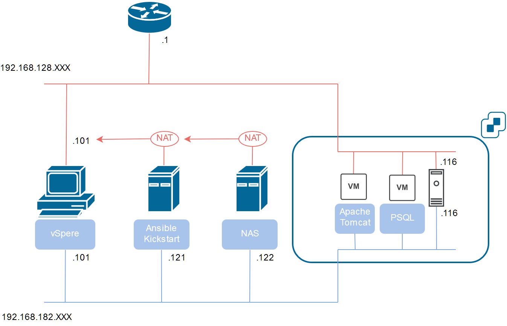

# ESXi 環境構築

* VMWare ESXi による仮想サーバ構築の練習
* ESXi 内の仮想マシンの作成、ミドルウェアの構築は Ansible で行う
* 物理サーバは調達できないため、VMware Workstation Player で仮想サーバを構築する

# 環境構成

## ホストOS

* Windows 10 Home
* VMWare Workstation Player
* vSphere Web Client
* VS Code + Java + Spring Boot

唯一の物理マシン、それ以外のサーバはすべて仮想マシン。
一次の仮想サーバはホストOSの VMWare Workstation Player（個人利用） によって構築される。

ブラウザベースの vSphere Web Client によって、ESXiサーバと、二次の仮想サーバの状態を管理する。

VS Code と Java + Spring Boot フレームワークによってローカルで業務APを開発し、Web/APサーバにデプロイする。

## 仮想サーバ（一次）

ホストOSの VMWare Workstation Player で作成される仮想サーバ。手動で構築する。

ファイルサーバ、ESXi 構築は後々 Ansible に移管予定。

### 構成管理サーバ

* CentOS 7（3.10.0-862.el7.x86_64）
* Ansible
* Kickstart

いちばん最初に構築する仮想サーバ。

Kickstart によって CentOS を自動インストールする iso を作成。その際に、手動でインストールした CentOS の anaconda-ks.cfg を改修して（ks.cfg）用いる。

Ansible の Playbook 実行により
* 二次の仮想サーバ
* ミドルウェア（Apache, Tomcat, PostgreSQL）

を構築

### ファイルサーバ

* CentOS 7（3.10.0-862.el7.x86_64）
* NFS
* Samba

共有フォルダとして /home/share を作成。
Ansible の Playbook や iso イメージを格納する。

構成管理サーバからはNFSマウントして使用

ESXi サーバにデータストアとして登録

ホストOS へは Samba で公開。本当は NFS マウントと Samba は同時に使用してはならない。

### ESXi サーバ

* VMWare ESXi 6.7.0 Update 2 (Build 13006603)

無償版 ESXi のため、スタンドアローンで、クラスタを組まない。

Ansible で、スタンドアローン ESXi 内に仮想マシンを作成するときは vsphere_guest モジュールを使用する。vsphere_guest は個人開発で、且つ Ansible バージョン2.9で廃止予定となっているが、どうしたものか。

同じようなモジュールで、VMWare 公式の vmware_guest があるが、こちらは vCenter 必須で、有償版でないと使えない

データストアは、サーバ内部のストレージとファイルサーバを割り当てる

業務LAN用、管理LAN用にそれぞれ vSwitch を持つ。ポートグループは以下の通り

|             | VMkernel | 仮想マシン |
| ----------- | -------- | --------- |
| **業務LAN** | Management Network | VM Network         |
| **管理LAN** | Control Network    | VM Control Network | 

## 仮想サーバ（二次）

ESXi 内に作成される仮想サーバ。Ansible の vsphere_guest モジュールによって構築。

vmdk は ESXi サーバ内のデータストアに格納する。NAS に格納すると I/O が低下するので。

### Web/AP サーバ

* Apache httpd
* Java + Tomcat
* 業務AP

### DB サーバ

* PostgreSQL

## NW

### 業務LAN

インターネット接続、SWパッケージのダウンロード、業務APでの通信に使用

ルータはPocket Wifi

構成管理サーバ・ファイルサーバはホストOS宛にNAT接続を、ESXiサーバと中の仮想サーバは VMWare Player のブリッジ接続を用いる

### 管理LAN

仮想サーバ間のファイル送受信、Ansible での構成管理に用いる。

VMWare Player のホストオンリーネットワークで構成。

