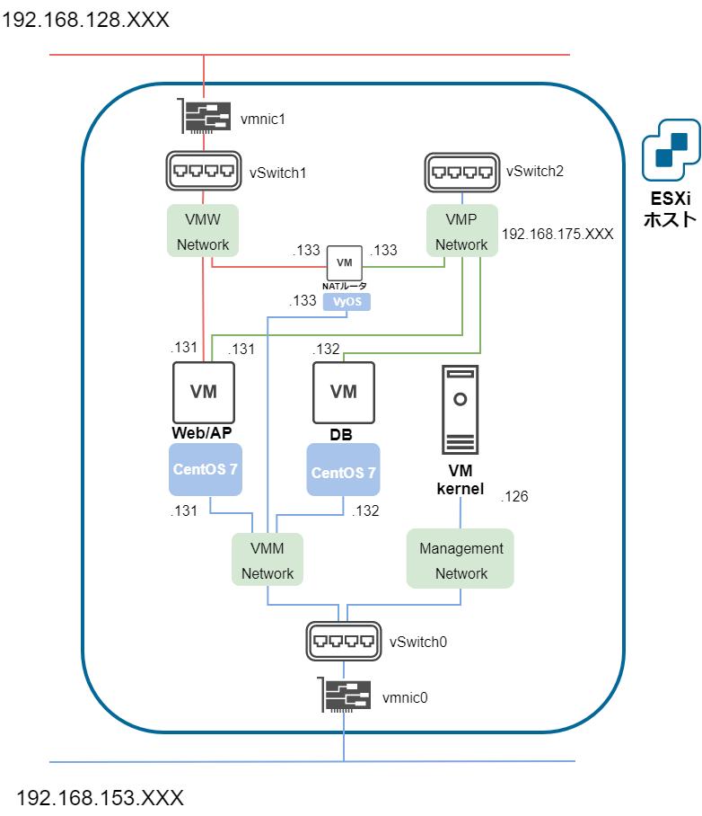

# 本書の目的

# システム概要図

## 初期構成

## 最終版構成

# システム詳細

## ホストOS

### [ホストOS設定](./01_ホストOS設定.md)

* VMware Playerのインストール

* VMWare Playerネットワーク設定

## 1次仮想マシン

### [構成管理サーバの作成](./02_構成管理サーバの作成.md)

* 仮想マシンの作成

* CentOSインストール

* OS設定

### [構成管理サーバへソフトウェアインストール](03_構成管理サーバへソフトウェアインストール.md)

* kickstartのインストール

* CentOS isoファイルの作成

* Ansibleのインストール

### [ESXiホストの作成](./04_ESXiホストの作成.md)

* 仮想マシンの作成

* ESXiインストール

## ESXi内部・2次仮想マシン（初期）

### [ESXiネットワーク設定](./05_ESXiネットワーク設定.md)

* 仮想スイッチの作成

* ポートグループの作成

### [2次仮想マシン作成](./06_2次仮想マシン作成.md)

* 手動で作成する
	
	後で最終版へ設定変更する場合はこの方法

* Ansibleで作成する

	後で最終版へ設定変更したい場合は、仮想マシンを削除して最終版用に新規作成する必要がある

### [2次仮想マシンOS設定]()

* CentOSインストール

* IPアドレス設定

## ESXi内部・2次仮想マシン（最終版）

### ESXiネットワーク設定

* 仮想スイッチの作成

* ポートグループの作成

### 仮想マシン作成

* 初期設定から設定変更する

* Ansibleで新規作成する

	仮想マシンを削除して最終版用に新規作成する

### CentOSネットワーク設定

* CentOSインストール

* IPアドレス設定

### VyOSネットワーク設定

* 基本設定

* NAT設定

## ミドルウェア

ESXi設定が初期か最終版かでアドレス設定が分かれる

| ESXi設定 | Web/APサーバ (DB接続用) | DBサーバ | リンク③ |
| :-: | :- | :- | :- |
| 初期 | 192.168.<b>128</b>.131 | 192.168.<b>128</b>.132 | jdbc:postgresql://192.168.<b>128</b>.132:5432/...
| 最終版 | 192.168.<b>175</b>.131 | 192.168.<b>175</b>.132 | jdbc:postgresql://192.168.<b>175</b>.132:5432/...

### [Ansibleによるミドルウェアの設定](./08_Ansibleによるミドルウェアの設定.md)

* 鍵交換

* 実行ファイルの編集

* Ansibleの実行

## アプリケーション

Terasolunaのサンプルアプリケーションを使用する

[Tour Reservation Sample Application](https://github.com/terasolunaorg/terasoluna-tourreservation)

### [warファイルの作成・デプロイ](09_warファイルの作成・デプロイ.md)

* ソースコードのダウンロード・編集

* Mavenによるwarファイルの作成

* warファイルの配置