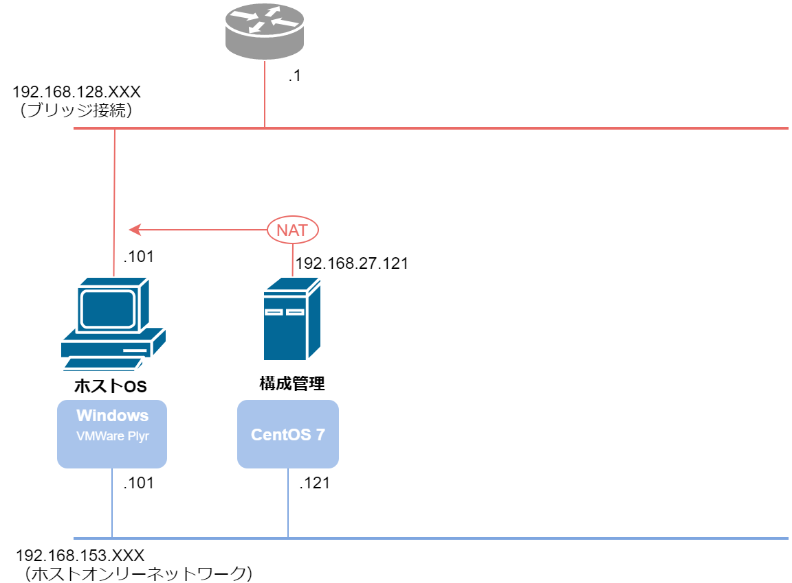

# 構成管理サーバの作成



実施内容

* 仮想マシンの作成
* CentOSインストール
* OS設定
	* CentOS ネットワーク設定
	* SELinux の無効化
	* SSHのDNS無効化
* VMWare Toolsのインストール

## マシン構成

| 物理設定 |  |
| :- | :- |
| 名前 | Control |
| ディスク容量 | 10GB |
| メモリ | 1GB |
| CPU | 1コア |
| NW | NAT, ホストオンリー |

<br>

| OS設定 |  |
| :- | :- |
| OS | CentOS 7.5 (64bit) |
| ホスト名 | CONTROL |
| rootパスワード | sN$87fzS |
| ネットワークアダプタ | ens33 (NAT), ens34 (ホストオンリー) |
| IPアドレス(ens33) | 192.168.27.121 |
| デフォルトGW(ens33) | 192.168.27.2 |
| IPアドレス(ens34) | 192.168.153.121 |
| デフォルトGW(ens34) | 未設定 |
| SELinux | 無効 |
| VMWare Tools | インストール |
| ホストOSとの<br>共有フォルダ | (ホスト) C:\Users\user\Desktop\shared<br>(ゲスト) /mnt/hgfs/shared/ |


## 仮想マシンの作成

### isoイメージのダウンロード

* 公式サイトの Cent OS 7 用ダウンロードページに移動

	http://isoredirect.centos.org/centos/7/isos/x86_64/

* 適当なミラーサイトから、CentOS 7 の Minimal.iso イメージをダウンロード

	http://ty1.mirror.newmediaexpress.com/centos/7.7.1908/isos/x86_64<br>
	→ CentOS-7-x86_64-NetInstall-1908.iso

### VMWare Player設定

* VMWare Player のホーム画面から「新規仮想マシンの作成」をクリック

	

* インストール元で、先ほどダウンロードしたisoファイルを選択

	

* 仮想マシン名を「Control」に

	

* ディスク容量を10GB、単一ファイルに設定

	

* 設定の確認<br>ホストオンリーNWの設定がないため後で追加する<br>「ハードウェアのカスタマイズ」をクリック

	

* ネットワークアダプタの確認<br>NATしかないためホストオンリーアダプタを追加する<br>「追加」ボタンをクリック

	

* 「ネットワークアダプタ」をダブルクリック
	
	

* 「ネットワークアダプタ 2」が追加されるため、「ホストオンリー」にチェックを入れてウィンドウを閉じる

	

* 再度設定の確認。「次へ」をクリック

	


## CentOSインストール

* ゲストOSのコンソール画面が開く<br>画面をクリックして、キーボードで「Install CentOS 7」を選択<br><b>※Alt + Ctrl キーでマウスカーソルがホストOSに戻る</b>

	

* 最初、VMWare Toolsのインストール画面が出るが、「後で確認する」にクリック（キャプチャ見切れてるけど）

	

* 言語設定 → 日本語

	

* インストール概要画面 → 「インストール先」をクリック

	

* デフォルトのまま「完了」をクリック

	

* インストール概要画面に戻るので、「ネットワークとホスト名」をクリック<br>それぞれのアダプタがオフになっているので、有効化する<br>IPアドレスはOSインストール後に設定する

	

* 有効化した後 ens33

	

* ens34<br>完了をクリック

	

* インストール概要画面に戻るので、「インストールの開始」をクリック

	

* インストールしている間にrootパスワードを設定


* パスワード "sN$87fzS" を入力して「完了をクリック」

	

* インストールが完了したら「再起動」ボタンをクリック

	

* OSが再起動してログイン画面が現れるので、rootユーザ、パスワード sN$87fzS でログインできるか確認

	

* その後、画面下の「インストールを完了しました」をクリックしてインストール作業は終了

## OS設定

### CentOS ネットワーク設定

#### IPアドレス設定

* ネットワークマネージャーを起動
	```
	# nmtui
	```

* 「Edit a connection」を選択

	

* ens33 (NAT) を選択

	

* アドレス設定し、「OK」を押して戻る

	

	* IPv4、GW は上の表の通りに
	* IPv6は Ignore（無効）
	
* ens34 (ホストオンリー) を選択。アドレス設定して戻る

	

	* IPv4、GW は上の表の通りに
	* IPv6は Ignore（無効）
	* 下から3行目の「Automatically connect」にチェックを入れる

#### ネットワークアダプタの再起動

* ネットワークマネージャのホーム画面に戻り、「Activate a connection」を選択

	

* それぞれのアダプタを再起動する（Enterキーを2回押下）<br>アダプタの頭に * がついていたらOK。<br>Backでホーム画面に戻る

	

#### ホスト名の変更

* 「Set System hostname」を選択

	

* ホスト名を「CONTROL.localdomain」に変更し、「OK」で戻る

	

* ホーム画面で「OK」を選択し、ネットワークマネージャを終了する

#### 設定確認

* ネットワークアダプタの状態確認

	```
	# nmcli device
	```
	⇒ ens33, ens34ともに connected となっていることを確認

* IPアドレスの確認

	```
	# ip addr
	```
	⇒ IPアドレスが設定されているものになっているか確認

	

* 疎通確認

	* ens33
		```
		# curl https://www.google.com/
		```
		⇒ webページがテキストで表示されたらOK

	* ens34
		
		ホストOSでコマンドプロンプトを起動し、
		```
		> ping 192.168.153.121
		```
		⇒ 応答が帰ってきたらOK

#### 参考

* [CentOSネットワーク設定(GUI/CUI環境,コマンド,手動方法)](https://mekou.com/linux-magazine/centos%E3%83%8D%E3%83%83%E3%83%88%E3%83%AF%E3%83%BC%E3%82%AF%E8%A8%AD%E5%AE%9Agui-cui%E7%92%B0%E5%A2%83%E3%82%B3%E3%83%9E%E3%83%B3%E3%83%89%E6%89%8B%E5%8B%95%E6%96%B9%E6%B3%95/)

* [CentOS 7でのネットワーク設定・確認方法 ](http://mzgkworks.com/post/linux-centos7-network-setting/)

### SELinux の無効化

* /etc/sysconfig/selinux ファイルの編集

	```
	# cp -ipv /etc/sysconfig/selinux /etc/sysconfig/selinux.org
	# vi /etc/sysconfig/selinux
	# diff /etc/sysconfig/selinux /etc/sysconfig/selinux.org
	```
	⇒ `SELINUX=enforcing` を `SELINUX=disabled` に

* OS再起動して反映させる。再度 root ログイン

	```
	# reboot
	```

* 設定確認

	```
	# getenforce
	```
	⇒ `Disabled` となっていることを確認

### SSHのDNS無効化

ホストオンリーの ens34 は DNS 設定をしていないため、普通に SSH ログインしようとすると非常に時間がかかる。<br>SSH の DNS 設定を無効にしてログイン時間を短縮する

* /etc/ssh/sshd_config ファイルの編集
	```
	# cp -ipv /etc/ssh/sshd_config /etc/ssh/sshd_config.org
	# vi /etc/ssh/sshd_config
	# diff /etc/ssh/sshd_config /etc/ssh/sshd_config.org
	```
	⇒ `#UseDNS yes` を `UseDNS no` に

* sshd の再起動

	```
	# systemctl restart sshd
	# systemctl status sshd
	```
	⇒ sshd が active であることを確認

* ホストOSから SSH ログイン

	コマンドプロンプトから
	```
	>ssh root@192.168.153.121
	```
	⇒ `Are you sure you want to continue connecting (yes/no)?` と出てきたら `yes[Enter]`<br>
	⇒ `root@192.168.153.121's password:` と出るのでパスワード `sN$87fzS` を入力<br>
	⇒ CONTROLにログイン出来たらOK

* ログアウト

	```
	[root@CONTROL ~]#
	[root@CONTROL ~]# exit
	ログアウト
	Connection to 192.168.153.121 closed.
	C:\Users\user>
	```

TeraTermでSSHログインしてもOK

#### 参考

* [SSHの接続が遅いとき](https://qiita.com/yshishido/items/9333cc2603f47f253330)


### VMWare Tools のインストール

#### 必要ライブラリのインストール

* パッケージのインストール

	```
	# yum install -y gcc perl wget git unzip patch
	```

#### kernel-develのインストール

* kernelのバージョン確認

	```
	# uname -r
	3.10.0-862.el7.x86_64
	```

* kernel-devel のインストール確認

	```
	# rpm -qa | grep "^kernel-devel"
	```
	⇒ kernel-develがインストールされていなければ次へ

* インストールしたCentOS 7が最新バージョンなら、理研のミラーサイトから rpmインストール

	```
	# rpm -ivh ftp://ftp.riken.jp/Linux/cern/centos/7/updates/x86_64/Packages/kernel-devel-$(uname -r).el7.x86_64.rpm
	```

* 古いバージョンの場合は、kernel-devel-[バージョン].rpmへのリンクを探してインストール

	例：http://rpm.pbone.net/index.php3/stat/4/idpl/43788839/dir/scientific_linux_7/com/kernel-devel-3.10.0-862.el7.x86_64.rpm.html

	```
	# rpm -ivh ftp://ftp.pbone.net/mirror/ftp.scientificlinux.org/linux/scientific/7.5/x86_64/os/Packages/kernel-devel-3.10.0-862.el7.x86_64.rpm
	```

* インストール確認

	```
	# rpm -qa | grep "^kernel-devel"
	kernel-devel-3.10.0-862.el7.x86_64
	```

##### 参考
* [Install Linux kernel-devel](https://qiita.com/metheglin/items/60261f474ccdfb467574)

#### VMWare Tools のインストール

* VMWare Player のコンソールから、[Player] > [管理] > [VMware Tools のインストール]

	

* 指示に従って VMTools のダウンロード

	

	

* ゲストOSにログインし、インストール用のコマンド実行

	```
	# mkdir -pv /mnt/cdrom
	mkdir: ディレクトリ `/mnt/cdrom' を作成しました

	# mount /dev/cdrom /mnt/cdrom
	mount: /dev/sr0 is write-protected, mounting read-only
	
	# cd /tmp
	# tar zxpf /mnt/cdrom/VMwareTools-x.x.x-yyyy.tar.gz
	# umount /dev/cdrom
	# cd vmware-tools-distrib
	# ./vmware-install.pl

	⇒ 色々聞かれるが、最初だけyes
	   それ以外はすべてデフォルトのまま[Enter]
	⇒ Enjoy,
	   --the VMware team と出てきたらOK
	```

##### 参考
* [Linux 仮想マシンへの VMware Tools の手動インストール](https://docs.vmware.com/jp/VMware-Workstation-Player-for-Windows/15.0/com.vmware.player.win.using.doc/GUID-08BB9465-D40A-4E16-9E15-8C016CC8166F.html)

## 共有フォルダ設定

### VMwarre上での設定

* VMWare Player のコンソールから、[Player] > [管理] > [仮想マシンの設定]

	

* [オプション] > [共有フォルダ] > [常に有効] をチェックし、<br>[フォルダ] > [追加] をクリック

	

* ホストOS側の共有フォルダを指定

	

* 「読み取り専用」にはチェックを入れないで設定を完了

	

### 共有フォルダ確認

* ゲストOSから共有フォルダを確認

	```
	# ls /mnt/hgfs
	shared
	# ls /mnt/hgfs/shared
	⇒ ホストOS側の共有フォルダの中身が表示されればOK
	```