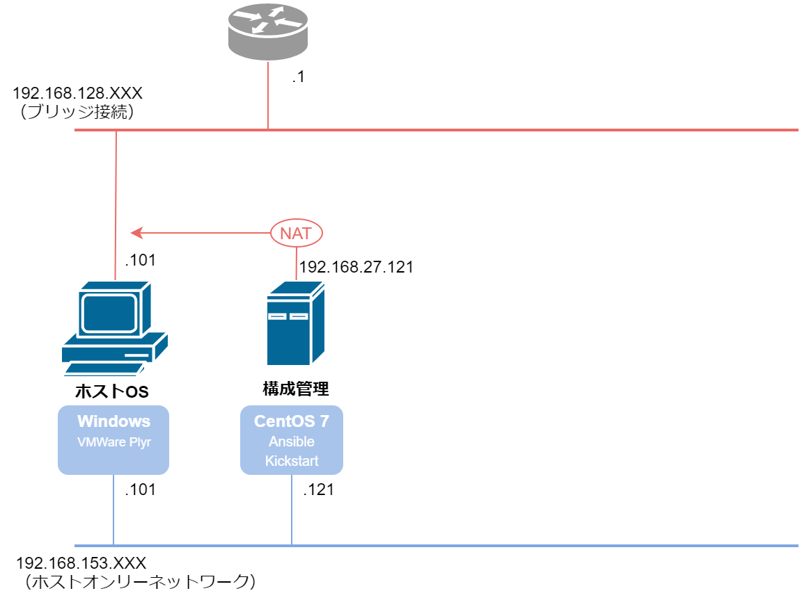

# 構成管理サーバへソフトウェアインストール



実施内容

* KickStart
	* KickStartインストール
	* CentOS自動インストール用の isoファイル作成
* Ansible
	* Ansibleインストール
	
## KickStart

### KickStartインストール

* 必要パッケージのインストール

	```
	yum -y install mkisofs pykickstart
	```

### isoファイル作成

ホストOSでの作業

* ホストOSの共有フォルダに、先ほどCentOS のインストールに使用したisoファイルを格納

	* ホストOS：‪C:\Users\user\Desktop\shared\CentOS-7-x86_64-Minimal-1804.iso
	* ゲストOS：/mnt/hgfs/shared/CentOS-7-x86_64-Minimal-1804.iso

ゲストOSでの作業

* 共有フォルダのisoファイルを /tmp にコピー

	```
	# cp -ipv /mnt/hgfs/shared/CentOS-7-x86_64-Minimal-1804.iso /tmp
	`/mnt/hgfs/shared/CentOS-7-x86_64-Minimal-1804.iso' -> `/tmp/CentOS-7-x86_64-Minimal-1804.iso'
	```

* isoファイルをマウントし展開、~/base の下にコピー

	```
	# mount -t iso9660 -o loop /tmp/CentOS-7-x86_64-Minimal-1804.iso /mnt
	mount: /dev/loop0 is write-protected, mounting read-only

	# ls /mnt
	CentOS_BuildTag  GPL       RPM-GPG-KEY-CentOS-7          images
	EFI              LiveOS    RPM-GPG-KEY-CentOS-Testing-7  isolinux
	EULA             Packages  TRANS.TBL                     repodata

	# mkdir ~/base
	# cp -RT /mnt ~/base
	# ls ~/base
	(省略)
	```

* マウントしたisoをアンマウント

	```
	# df
	ファイルシス            1K-ブロック    使用  使用可 使用% マウント位置
	/dev/mapper/centos-root     8374272 3604000 4770272   44% /
	(省略)
	/dev/loop0                   927282  927282       0  100% /mnt

	# umount /dev/loop0
	# ls /mnt
	cdrom  hgfs
	```

* ゲストOSの anaconda-ks.cfg を共有フォルダ経由でホストOSにコピー

	```
	# cp -ipv ~/anaconda-ks.cfg /mnt/hgfs/shared/
	`/root/anaconda-ks.cfg' -> `/mnt/hgfs/shared/anaconda-ks.cfg'
	```

* 共有フォルダの anaconda-ks.cfg を編集する。解説は[こちらのサイトで](https://qiita.com/uturned0/items/92f2e75c8533e8465e8b)
	
	```
	# diff ~/anaconda-ks.cfg /mnt/hgfs/shared/

	(各セクションの上部：編集前、下部：編集後)

	6,7c6,9
	< # Use graphical install
	< graphical
	---
	> # Use text mode install
	> text
	> # Do not configure the X Window System
	> skipx
	
	17,18c19,20 ← ネットワーク設定はOSインストール後に設定するため、コメントアウト
	< network  --bootproto=dhcp --device=ens33 --ipv6=auto 	--activate
	< network  --bootproto=dhcp --device=ens34 --onboot=off --ipv6=auto --activate
	---
	> # network  --bootproto=dhcp --device=ens33 --ipv6=auto --activate
	> # network  --bootproto=dhcp --device=ens34 --onboot=off --ipv6=auto --activate
	
	20a23,25 ← SELinux無効化設定を追加
	> # Disable SELinux
	> selinux --disabled
	>
	
	29c34
	< autopart --type=lvm
	---
	> autopart --type=lvm --nohome
	
	32a38,40
	> # Installation logging level
	> logging --level=debug
	>
	
	49a58,59
	>
	> reboot --eject
	```

* 編集した anaconda-ks.cfg をゲストOSにコピー

	```
	cp -ipv /mnt/hgfs/shared/anaconda-ks.cfg ~/base/ks.cfg
	`/mnt/hgfs/shared/anaconda-ks.cfg' -> `/root/base/ks.cfg'
	```

* 文法チェック

	```
	cd ~/base
	ksvalidator ks.cfg
	```
	
* autorun という項目で、インストールDVDのISOイメージ内の ks.cfg を読ませる場合の設定

	```
	# cat >> ~/base/isolinux/isolinux.cfg <<EOL
	label autorun
	  menu label ^KIckStartAutoRun
	  menu default
	  kernel vmlinuz
	  append initrd=initrd.img inst.stage2=cdrom: inst.ks=cdrom:
	EOL
	```

* 出来上がったファイルイメージをISO形式に変換

	```
	# mkisofs -v -r -J -o ../CentOS-7-KickStart.iso -b isolinux/isolinux.bin -c isolinux/boot.cat -no-emul-boot -boot-load-size 4 -boot-info-table .
	⇒ 463643 extents written (905 MB)
	# ls ~/*.iso
	/root/CentOS-7-KickStart.iso
	```

* isoファイルを共有フォルダ経由でホストOSに送る
	```
	mv ~/CentOS-7-KickStart.iso /mnt/hgfs/shared/
	```

* 不要になったファイル・ディレクトリを削除

	```
	cd
	rm -rf ~/base
	rm -ir /tmp/CentOS-7-x86_64-Minimal-1804.iso
	```

### 参考

* [kickstartをマスターしたのでメモっておく](https://qiita.com/uturned0/items/92f2e75c8533e8465e8b)


## Ansible

ESXiで仮想マシンを作成するモジュール「vsphere_guest」は Ansibleバージョン2.9以前でしか使えない（ver 2.9で廃止）ため、バージョン2.8.7をインストールする

また、vsphere_guestはpython2系でしか使えないため、python2用の pipもインストールする

### Ansibleのインストール

* パッケージのインストール

	```
	# yum install -y epel-release
	# yum install -y python2-pip
	# pip install ansible\==2.8.7
	# ansible --version
	ansible 2.8.7
	(省略)
	python version = 2.7.5 (default, Apr 11 2018, 07:36:10) [GCC 4.8.5 20150623 (Red Hat 4.8.5-28)]
	```

