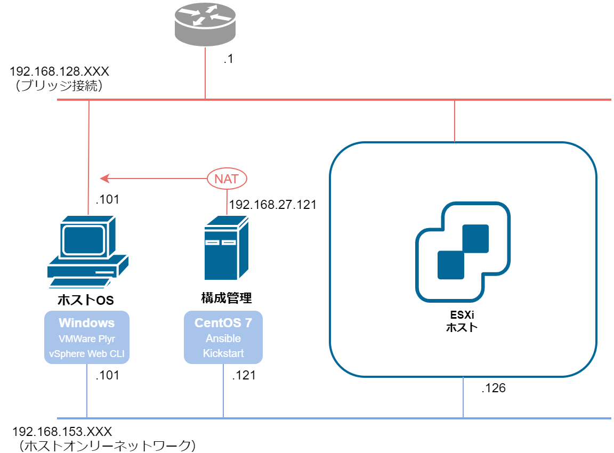
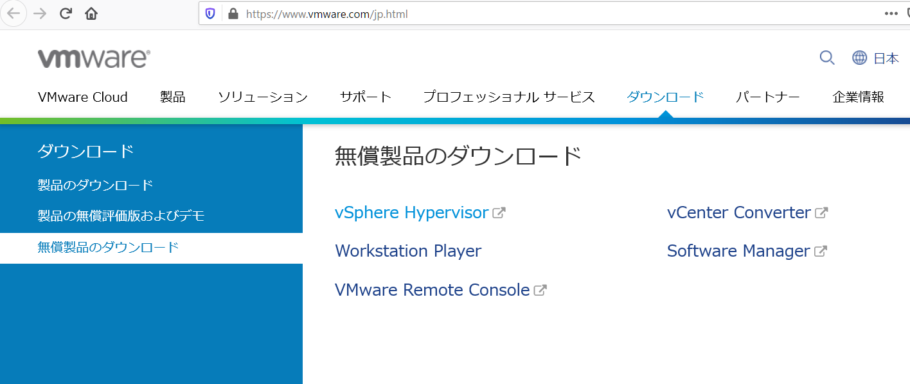
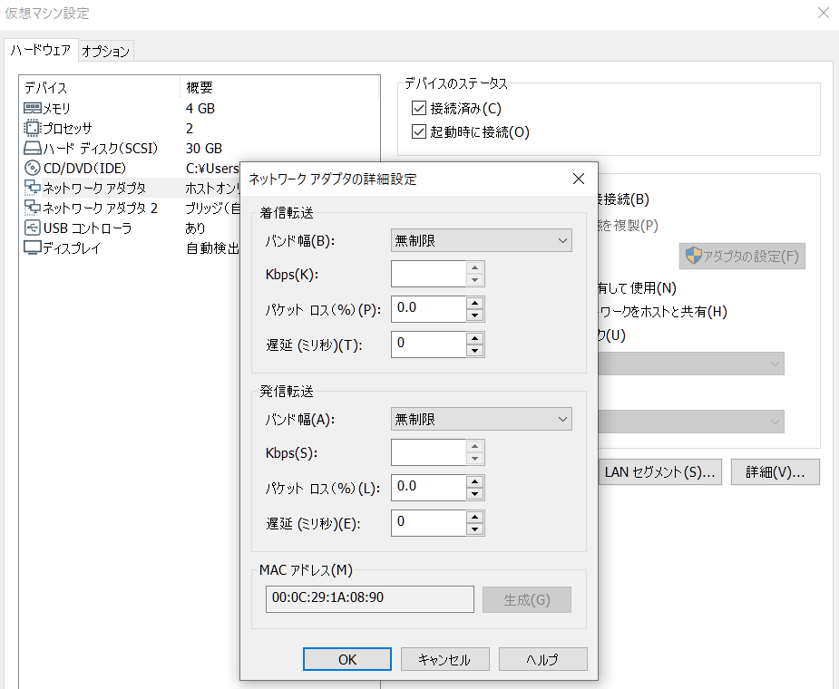

# ESXiホスト作成

実施内容

* 仮想マシンの作成

* ESXiインストール

* ESXi設定
	* IPアドレス設定
	* シェル・SSH有効化
	* vSphere Web Client へログイン
	* ライセンス登録

## マシン構成

| 物理設定 |  |
| :- | :- |
| 名前 | ESXi |
| ディスク容量 | 30GB |
| メモリ | 4GB |
| CPU | 2コア |
| NW | ホストオンリー, ブリッジ接続 |

 

| ESXi設定 |  |
| :- | :- |
| ホスト名 | ESXI-HOST |
| rootパスワード | sN$87fzS |
| ネットワークアダプタ | vmnic0 (ホストオンリー), vmnic1 (ブリッジ接続) |
| IPアドレス(管理用) | 192.168.153.126 |
| デフォルトGW(管理用) | 未設定 |
| シェル | 有効 |
| SSHログイン | 有効 |

## 仮想マシンの作成

### isoイメージのダウンロード

<b>※ My VMWare のアカウント登録が必要</b>

* VMware の公式サイトにアクセス

	https://www.vmware.com/jp.html

* [ダウンロード] > [無償製品のダウンロード] > [vSphere Hypervisor] をクリック

	

* [アカウントの作成] をクリックして、アカウント登録した後にログインしなおす

	

* ライセンスキーを確認しておく isoファイルがダウンロード可能になるので、[手動ダウンロード] をクリックしてダウンロード

	

	※本書では「6.7 Update 3- バイナリ」ではなく、「6.7 Update 2- Binaries」を用いている

### VMWare Player設定

* 新規仮想マシンの設定を入力 特に注意すべきポイントは以下

	* [プロセッサ] > [仮想エンジン] の「Intel VT-x/EPTまたは...」にチェックが入っていることを確認

		

	* [ネットワークアダプタ] にホストオンリー、[ネットワークアダプタ 2] にブリッジを設定

		

	* 最終的な設定は下のようになる

		
	
* 設定を完了させて仮想マシンを起動

## ESXiインストール

<b>※Alt + Ctrl キーでマウスカーソルがホストOSに戻る</b>

* ライセンス同意画面。F11（同意）を押下

	

* ディスク選択画面。そのまま Enterを押下

	

* 言語は [Japanese] を選択

	

* rootパスワード [sN$87fzS] を入力

	

* インストール確認画面が出るので、F11を押下してインストール開始

	

* インストール完了画面。Enterキーを押して再起動

	

* 下のようなホーム画面が出てきたらOK
	
	

## ESXi設定

### ネットワーク設定

* ホーム画面でF2キーを押して設定画面に

* 途中でユーザ認証を求められるので、rootユーザのパスワード [sN$87fzS] を入力してEnter

	

* 設定画面から [Configure Management Network] を選択

	

* [Network Adapters] を選択

	

* 管理用（ホストオンリー）のネットワークアダプタ [vmnic0] が選択されていることを確認してEnter

	

	* どちらがホストオンリーのアダプタかは、仮想マシン設定画面でMACアドレスを確認して判断する

		

* [IPv4 Configuration] を選択

	

* 管理用のIPアドレスを設定してEnter

	

* [IPv6 Configuration] を選択し、[Disable IPv6] を選択してEnter

	

* ホスト名 [ESXI-HOST] を入力してEnter

	

* Escキーを押して設定画面を抜ける

	

* 設定反映のためにホストの再起動を求められるので [Yes] を選択

	

* 再起動後のホーム画面で、IPアドレスとホスト名を確認

	

### シェル・SSH有効化

* 設定画面から [Troubleshooting Options] を選択

	

* [Enable ESXi Shell] で Enterを押下して有効化

	

* 画面右側で [ESXi Shell is Enabled] となっていることを確認

	

* 同様にSSHも有効化して設定画面を抜ける

	

### vSphere Web Client へログイン

* ホストOSのブラウザから、vSphere Web Clientにアクセス 途中 HTTPS 証明書の警告が出るが無視

	https://192.168.153.126/

* ログイン画面で、ユーザ [root]、パスワード [sN$87fzS] を入力してログイン

	

* ホーム画面が表示されることを確認

	

### ライセンス登録

* ホーム画面左側のメニューから、[ホスト] > [管理] をクリックしてホスト管理画面を表示

	

* ホスト管理画面の、[ライセンス] タブをクリック

	

* ライセンスキーを入力して [ライセンスの確認] をクリック

	

* [ライセンスの割り当て] をクリック

	

* ライセンスキーが登録されていればOK

	
