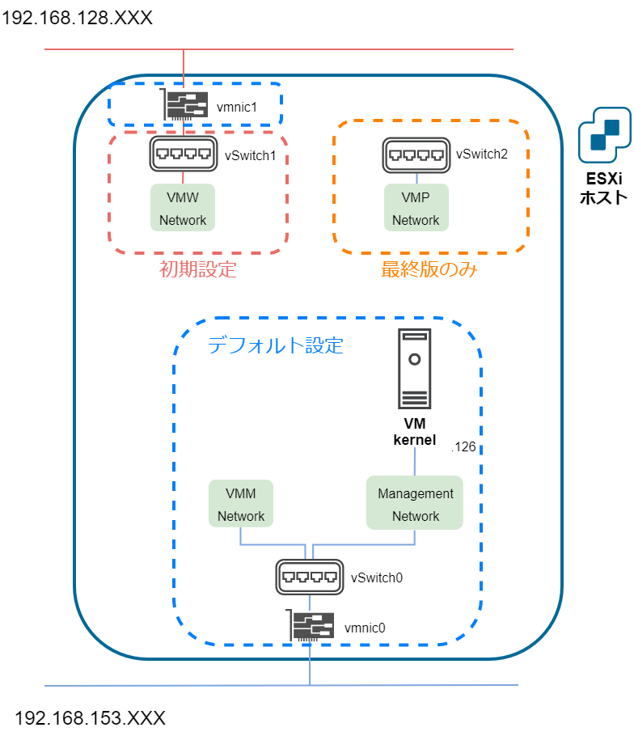

# ESXiホスト作成

実施内容

* 既存設定の確認

* 初期設定
	* 仮想スイッチの作成
	* ポートグループの作成

* 最終版設定
	* 仮想スイッチの作成
	* ポートグループの作成

## 既存設定の確認

* 物理NICの確認

	

* 仮想スイッチの確認

	

* ポートグループの確認

	

* ネットワーク構成の確認

	

* ポートグループの名前変更

	

## 初期設定

### 仮想スイッチの作成

### ポートグループの作成

## 最終版設定

### 仮想スイッチの作成

### ポートグループの作成

