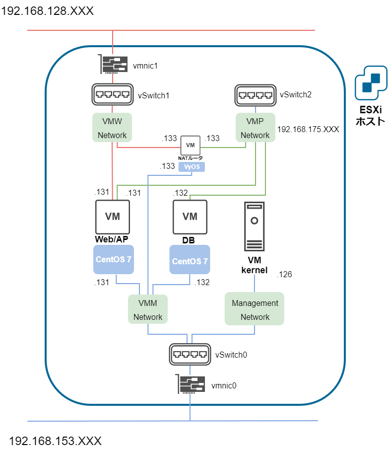

# 2次仮想マシン作成




実施内容

* 事前準備

* パターン１ 手動で作成する

* パターン２ Ansibleモジュールを利用して作成する

* Cent OS設定

* VyOS設定

## マシン構成

### 物理設定

| 物理設定 | Web/APサーバ | DBサーバ | NATルータ |
| :- | :- | :- | :- |
| 名前 | CentOS-1 | CentOS-2 | VyOS |
| ディスク容量 | 4GB | 4GB | 2GB |
| メモリ | 1GB | 1GB | 512MB |
| CPU | 1コア | 1コア | 1コア |
| ポートグループ | VMM Network,<br>VMW Network,<br>VMP Network | VMM Network,<br>VMP Network | VMM Network,<br>VMW Network,<br>VMP Network |
| OS | CentOS 7.5 (64bit) | CentOS 7.5 (64bit) | VyOS 1.2.4 (64bit) |
| データストア | datastore1 | datastore1 | datastore1 |

### OS設定

| OS設定 |  CentOS-1 | CentOS-2 | VyOS |
| :- | :- | :- | :- |
| OS | CentOS 7.5 (64bit) | CentOS 7.5 (64bit) | VyOS 1.2.4 |
| ホスト名 | WEBAP | DB | vyos |
| rootパスワード | sN$87fzS | sN$87fzS | vyos (ユーザ : vyos) |
| ネットワークアダプタ | ens192 (VMM 管理用),<br>ens224 (VMW 外部),<br>ens256 (VMP 内部) | ens192 (VMM 管理用),<br>ens256 (VMP 内部) | ens192 (VMM 管理用),<br>ens224 (VMW 外部),<br>ens256 (VMP 内部) |
| IPアドレス (管理) | ens192 :192.168.153.131 | ens192 : 192.168.153.131 | eth0 : 192.168.153.133 |
| デフォルトGW (管理) | ens192 : - | ens192 : - | eth0 : - |
| IPアドレス (外部) | ens224 : 192.168.128.131 | ens224 : - | eth1 : 192.168.128.133 |
| デフォルトGW (外部) | ens224 : 192.168.128.1 | ens224 : - | eth1 : 192.168.128.1 |
| IPアドレス (内部) | ens256 : 192.168.175.131 | ens256 : 192.168.175.131 | eth2 : 192.168.175.133 |
| デフォルトGW (内部) | ens256 : - | ens256 : - | eth2 : - |
| SELinux | 無効 | 無効 | - |
| VMWare Tools | インストールしない | インストールしない | - |


## 事前準備

ホストOSで vSphere Web Client にログイン

* [ストレージ] > [データストア] > [datastore1] > [データストアブラウザ]

* [datastore1] 内にディレクトリ [iso] を新規作成し、作成した CentOS isoイメージと、VyOSの isoイメージをアップロードする

	[VyOS公式ダウンロードサイト](https://www.vyos.io/rolling-release/)


## 手動で作成する

（省略）

## Ansibleモジュールを利用して作成する

ホストOSから構成管理サーバにSSH接続して作業

### 必須モジュールのインストール

* Ansibleモジュール vsphere_guest に必要なpythonモジュール pysphere をインストールする

	```
	pip2 install pysphere
	pip2 show pysphere
	```

### yamlファイルの編集

* ホストOSでyamlファイルを編集し、共有フォルダ経由で構成管理サーバに送る<br>設定ファイルの書き方は参考ページを参照

* ホストOSの共有フォルダ内構成

	```
	共有フォルダ（Desktop\shared）
		│
		└ vsphere_guest\
			│
			├ inventory
			└ task.yml
	```

### ansibleの実行

* 構成管理サーバにSSHログインし、Ansibleを実行

	```
	# cd /mnt/hgfs/shared/vsphere_guest/
	# ansible-playbook --check -i inventory task.yml
	(省略)
	⇒ エラーが発生しなければok

	# ansible-playbook -i inventory task.yml
	(省略)
	⇒ エラーが発生しなければok
	```

* vSphere Web Client にログインし、仮想マシン CentOS-1,2, vyos が作成・起動されていることを確認

* CentOS1,2 の詳細画面に移動し、CentOSの自動インストールが行われていることを確認

### 参考

* [vsphere_guest](https://docs.ansible.com/ansible/2.7/modules/vsphere_guest_module.html)

* [Ansible で ESXi を操作してみる[VM作成編]](https://qiita.com/hirofumihida/items/177dd47c5834477b85ec)

* [Ansible で vSphere 上に複数の仮想マシンを作成する](http://sig9.hatenablog.com/entry/2017/09/26/000000)


## 仮想マシンOS設定

### CentOS設定

（省略）

### VyOS設定

#### 参考

* [VyOSユーザーガイド](https://wiki.vyos-users.jp/index.php/%E3%83%A6%E3%83%BC%E3%82%B6%E3%83%BC%E3%82%AC%E3%82%A4%E3%83%89)