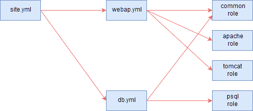

# 事前準備

## 鍵認証設定

### webap/dbサーバで.sshディレクトリの作成
ssh root@192.168.153.131
ssh root@192.168.153.132

mkdir -pv ~/.ssh

### 構成管理サーバでキーペアの作成

cd ~/.ssh
ssh-keygen -t rsa -f id_rsa
パスワードは空欄

### サーバに鍵を転送

scp ./id_rsa.pub root@192.168.153.131:~/.ssh/
scp ./id_rsa.pub root@192.168.153.132:~/.ssh/
[sN$87fzS]

### サーバ側の設定

ssh root@192.168.153.131
ssh root@192.168.153.132

cd ~
chmod 700 .ssh
cd .ssh
cat id_rsa.pub >> authorized_keys
chmod 600 authorized_keys
rm -iv id_rsa.pub
[y]

cp -ipv /etc/ssh/sshd_config /etc/ssh/sshd_config_20191230
vi /etc/ssh/sshd_config
diff /etc/ssh/sshd_config /etc/ssh/sshd_config_20191230
⇒
43c43
< PubkeyAuthentication yes
---
> #PubkeyAuthentication yes

which sshd
/usr/sbin/sshd -t
⇒ 何も表示されない
systemctl restart sshd

exit
⇒ 構成管理サーバに戻る

### 構成管理サーバからSSHログイン確認

ssh -i ~/.ssh/id_rsa root@192.168.153.131
ssh -i ~/.ssh/id_rsa root@192.168.153.132
⇒ サーバにログイン
exit
⇒ 構成管理サーバに戻る
ssh root@192.168.153.131
ssh root@192.168.153.132
⇒ サーバにログイン

https://qiita.com/gotohiro55/items/36a22516de2b381b3c6e

# 構成

https://thinkit.co.jp/article/9871

# 実行

cd /mnt/hgfs/shared/ansible_mw/
ansible-playbook --check -i staging site.yml
ansible-playbook -i staging site.yml