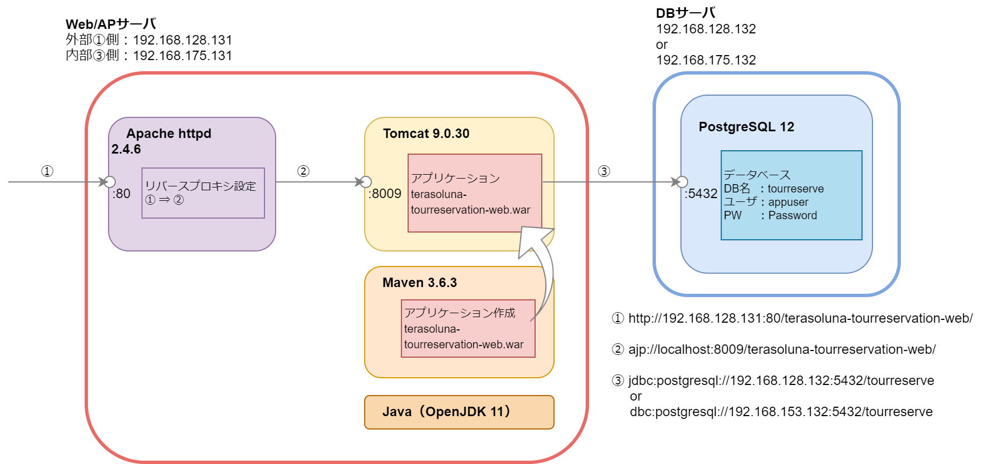
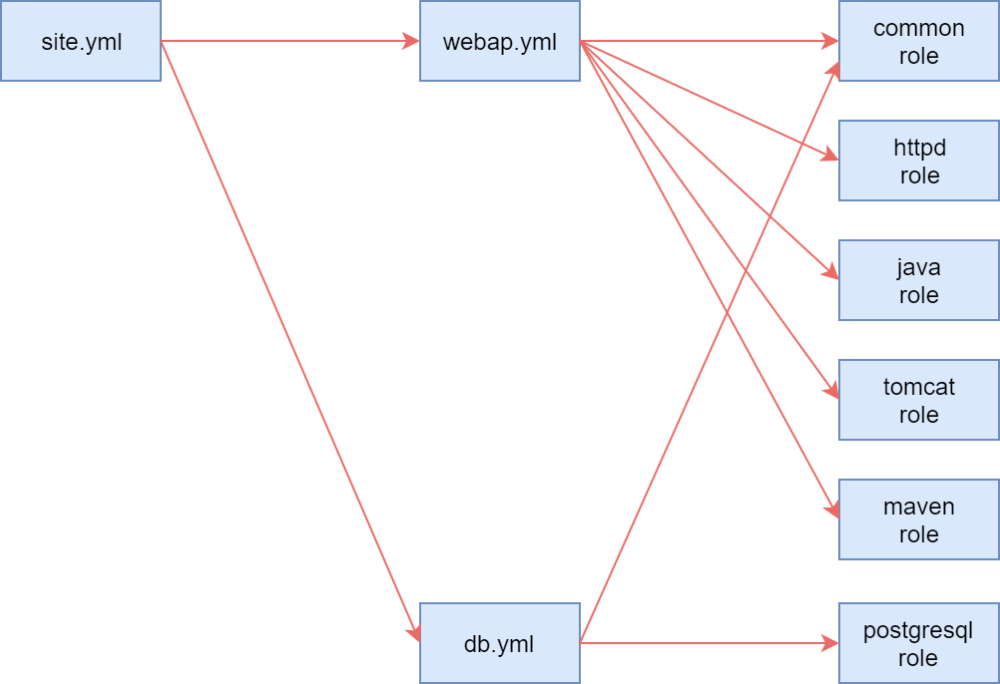

# Ansibleによるミドルウェアの設定



実施内容


## 鍵認証設定

### webap/dbサーバで.sshディレクトリの作成

```
ssh root@192.168.153.131
ssh root@192.168.153.132
```

```
mkdir -pv ~/.ssh
exit
```

### 構成管理サーバでキーペアの作成

```
cd ~/.ssh
ssh-keygen -t rsa -f id_rsa
パスワードは空欄
```

### サーバに鍵を転送

```
scp ./id_rsa.pub root@192.168.153.131:~/.ssh/
scp ./id_rsa.pub root@192.168.153.132:~/.ssh/
パスワード : [sN$87fzS]
```

### サーバ側の設定

```
ssh root@192.168.153.131
ssh root@192.168.153.132
```

```
cd ~
chmod 700 .ssh
cd .ssh
cat id_rsa.pub >> authorized_keys
chmod 600 authorized_keys
rm -iv id_rsa.pub
[y]
```

```
cp -ipv /etc/ssh/sshd_config /etc/ssh/sshd_config.org
vi /etc/ssh/sshd_config
diff /etc/ssh/sshd_config /etc/ssh/sshd_config.org
⇒
43c43
< PubkeyAuthentication yes
---
> #PubkeyAuthentication yes
```

```
# which sshd
/usr/sbin/sshd
# /usr/sbin/sshd -t
⇒ 何も表示されない
systemctl restart sshd
systemctl status sshd

exit
⇒ 構成管理サーバに戻る
```

### 構成管理サーバからSSHログイン確認

```
ssh -i ~/.ssh/id_rsa root@192.168.153.131
ssh -i ~/.ssh/id_rsa root@192.168.153.132
⇒ サーバにログイン
exit
⇒ 構成管理サーバに戻る
```

```
ssh root@192.168.153.131
ssh root@192.168.153.132
⇒ サーバにログイン
```

https://qiita.com/gotohiro55/items/36a22516de2b381b3c6e


## yamlファイルの編集



https://thinkit.co.jp/article/9871

## Ansibleの実行

```
yum install -y https://download.postgresql.org/pub/repos/yum/reporpms/EL-7-x86_64/pgdg-redhat-repo-latest.noarch.rpm
yum install -y postgresql12-devel

~/.bash_profileに追記
⇒ export PATH=/usr/pgsql-12/bin:$PATH
. ~/.bash_profile

yum install -y https://centos7.iuscommunity.org/ius-release.rpm
yum install -y python36u python36u-devel python36u-libs
yum install -y python36u-pip
pip3 install psycopg2
pip3 show psycopg2
```

```
cd /mnt/hgfs/shared/ansible_mw/
ansible-playbook --check -i staging site.yml
ansible-playbook -i staging site.yml
```

```
PLAY [deploy webservers] *******************************************************

(省略)

PLAY RECAP *********************************************************************
192.168.153.131            : ok=28   changed=8    unreachable=0    failed=0    skipped=5    rescued=0    ignored=0
192.168.153.132            : ok=15   changed=2    unreachable=0    failed=0    skipped=1    rescued=0    ignored=0
```

## 結果確認

### Apache

ホストOSのブラウザから以下のURLにアクセス

http://192.168.128.131/

Apache の 404 Not Found ページが出てくればOK

### Tomcat

ホストOSのブラウザから以下のURLにアクセス

http://192.168.128.131/terasoluna-tourreservation-web/

Apache の 404 Not Found ページが出てくればOK

### PostgreSQL

ホストOSに pgAdmin4 をインストールし、DBサーバの tourreserve データベースに接続

⇒ 接続できればOK


